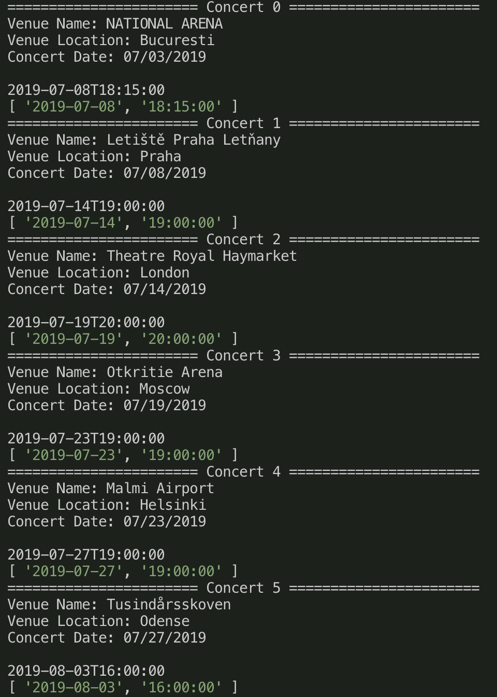
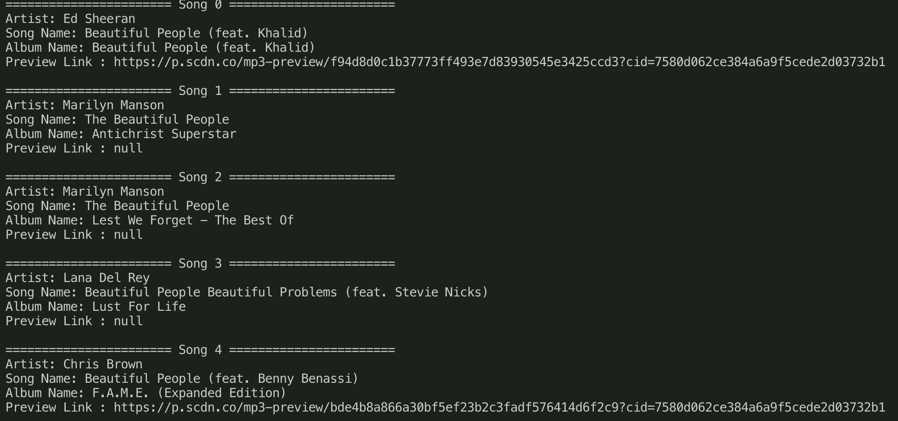
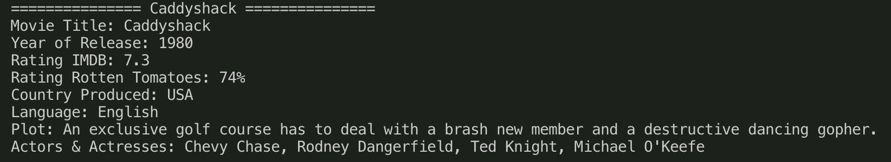
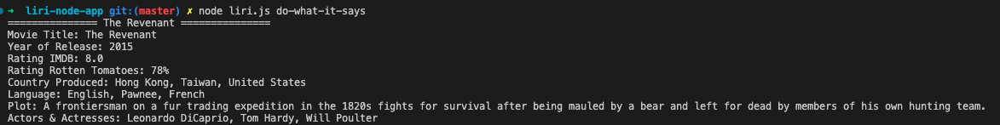

# liri-node-app

## Overview

LIRI is a Language Interpretation and Recognition Interface. LIRI is a command line node app that takes in parameters and gives you back data.

## Valid Commands

- concert-this
- spotify-this-song
- movie-this
- do-what-it-says

## Step By Step Instructions

1. Open terminal and navigate to liri-node-app folder.

2. There are 4 valid commands listed above. If you want to see Ed Sheerans's upcoming concerts you would do the following command.

```
node liri.js concert-this "ed sheeran"
```

3. The output from the above input looks like this.



## node spotify api search method #1

- supposed to be the easiest method according to documentation

```js

search: function({ type: 'artist OR album OR track', query: 'My search query', limit: 20 }, callback);

```

## node spotify api search method #2

```js

var Spotify = require('node-spotify-api');

var spotify = new Spotify({
  id: <your spotify client id>,
  secret: <your spotify client secret>
});

spotify.search({ type: 'track', query: 'All the Small Things' }, function(err, data) {
  if (err) {
    return console.log('Error occurred: ' + err);
  }

console.log(data);
});

```

### Example 2

```
node liri.js spotify-this-song "beautiful people"
```



### Example 3

```
node liri.js movie-this "caddyshack"
```



### Example 4

```js
node liri.js do-what-it-says
```

this command takes input from the file random.txt to perform a query


